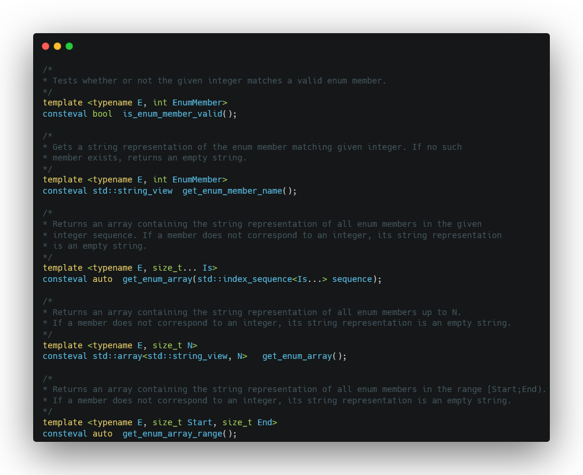

## Constexpr enum mapping
### Mapping enums to their string representation at compile time.

These are functions that allow compile-time mapping of enum members to their string representation.
Said differently, it means that with an integer, you can get an `std::string_view` of what that integer corresponds to in any enum.

For example:
```C++
enum e_example {
	FOO,
	BAR,
	SIZEOF_ENUM
};

constexpr auto name = const_enum::get_enum_member_name<e_example, 1>();
std::cout << name << '\n';	// Prints "BAR"
```

### What for?

Anything, really. Maybe you want to debug your code and know what that `int` in the console means without having to dig through header files. Maybe you cannot be bothered to manually declare a `std::map` by copy pasting each enum value twice. Or maybe you just want to do cool shit with `constexpr` and templates.

```C++
std::map<e_example, std::string_view> my_map = {
	{FOO, "FOO"},
	{BAR, "BAR"},
	// etc. Boring. Error-prone. Cringe as shit.
}

// Exciting. Error-free. Based.
constexpr auto enum_names = const_enum::get_enum_array<e_example, SIZEOF_ENUM>();
```

### How?

You need C++17 or greater for this to work, because it's using `std::string_view`. This implementation has been made for the MSVC compiler, but it can certainly be ported over to gcc/clang/whatever.

To use, simply include `const_enum.hpp`. Functions are in the `const_enum` namespace. Examples are available in the `examples` directory, and are also below, because you probably can't be bothered:

```C++
enum e_example {
	FOO = 0,
	BAR,
	FOOBAR = 4,
	FIZZ,
	BUZZ,
	SIZEOF_ENUM
};

/*
* You can get an array matching your enum, containing all enum names as string_views.
* If there are values not contained in your enum, they're replaced by an empty string.
*/
constexpr auto names_array = const_enum::get_enum_array<e_example, SIZEOF_ENUM>();
// Returns ["FOO", "BAR", "", "", "FOOBAR", "FIZZ", "BUZZ"]

/*
* You can also just take a range in the enum instead of the whole thing:
*/
constexpr size_t offset = 4;
constexpr auto ranged_names_array = const_enum::get_enum_array_range<e_example, offset,SIZEOF_ENUM>();
// Returns ["FOOBAR", "FIZZ", "BUZZ"]

/*
* Or simply get the string representation of any integer you'd like.
* Once again, empty string means no matching enum value.
*/
constexpr int check_me = 6;
constexpr auto name = const_enum::get_enum_member_name<e_example, check_me>();
// Returns "BUZZ"

/*
* If you just want to check if a certain value has a matching enum member, use this:
*/
constexpr bool has_member_3 = const_enum::is_enum_member_valid<e_example, 3>();
// Returns false
constexpr bool has_member_4 = const_enum::is_enum_member_valid<e_example, 4>();
// Returns true

/*
* Once you have determined enum values at compile-time, it's very easy to get what
* you want at runtime, just index the array. If you use a library with constexpr maps,
* you could even make it so you have a constexpr map of values.
*/
for (int i = 0; i < SIZEOF_ENUM; ++i)
	std::cout << std::format("At runtime, {} corresponds to '{}'\n", i, names_array[i]);
```

Here is a pretty picture of available functions:


